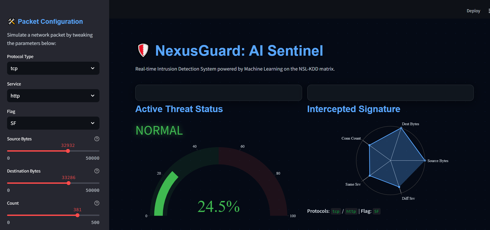

# 🛡️ NexusGuard: AI Network Sentinel

An AI-driven, real-time Intrusion Detection System (IDS) dashboard. NexusGuard leverages Machine Learning (Random Forest) to instantly dissect network packet signatures, flagging anomalous behavior with a sleek, cyberpunk-inspired visualization matrix built on Streamlit.

## Dashboard Preview




## Features

- **Live Anomaly Detection**: Uses a Random Forest classifier to instantly evaluate network packets.
- **Sleek Interface**: Custom dark-mode UI with glassmorphism and real-time threat animations.
- **Interactive Tuning**: Manually adjust packet features like byte counts, protocols, and service connections to see how the model reacts.

## Quick Start

### 1. Clone the repository

```bash
git clone https://github.com/YounisJ/NexusGuard.git
cd NexusGuard
```

### 2. Install dependencies

It is recommended to use a virtual environment.

```bash
pip install -r requirements.txt
```

### 3. Add the Dataset

1. Download the NSL-KDD dataset (`KDDTrain+_20Percent.txt`).
2. Create a folder named `data` in the project root.
3. Place `KDDTrain+_20Percent.txt` inside the `data` folder.

*(Note: If you run it locally and the app detects your system's absolute path to the dataset, it will fallback to that automatically.)*

### 4. Run the Dashboard

```bash
streamlit run app.py
```

The application will launch in your default web browser.

## Built With
- **Python 3**
- **Streamlit** (Frontend Dashboard)
- **Scikit-Learn** (Random Forest Classifier)
- **Pandas** (Data manipulation)
